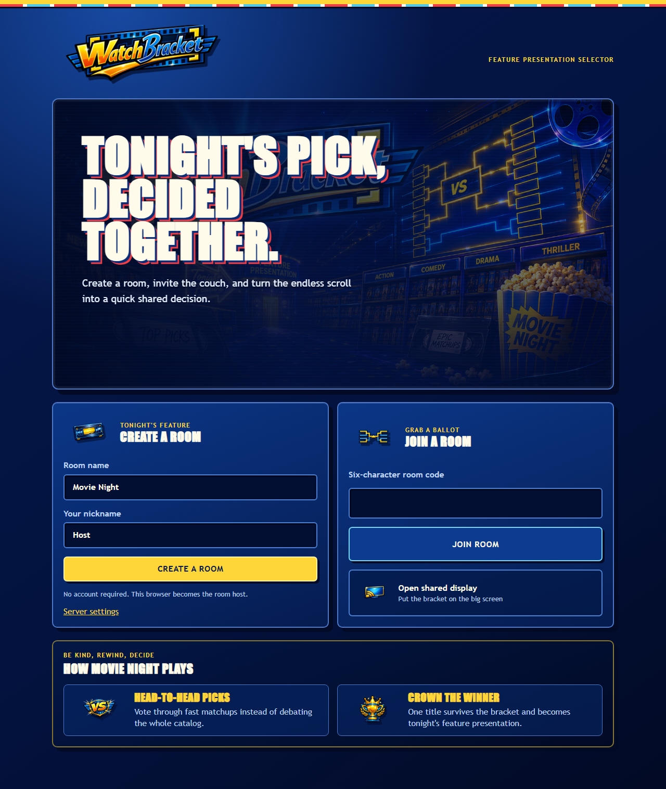
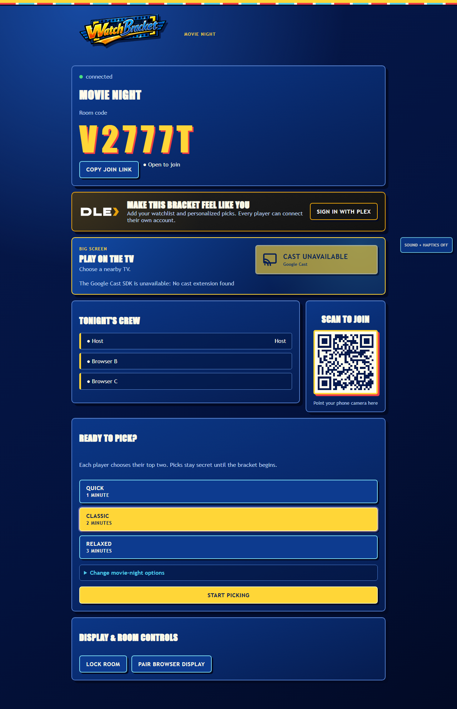
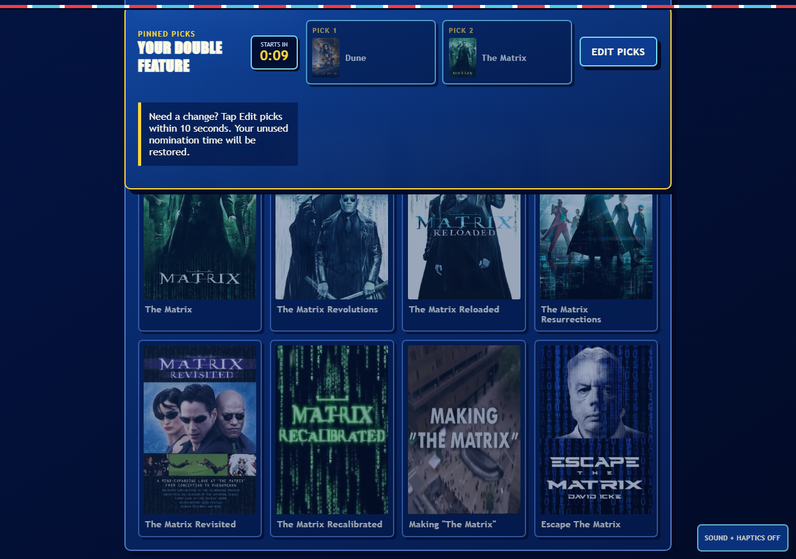
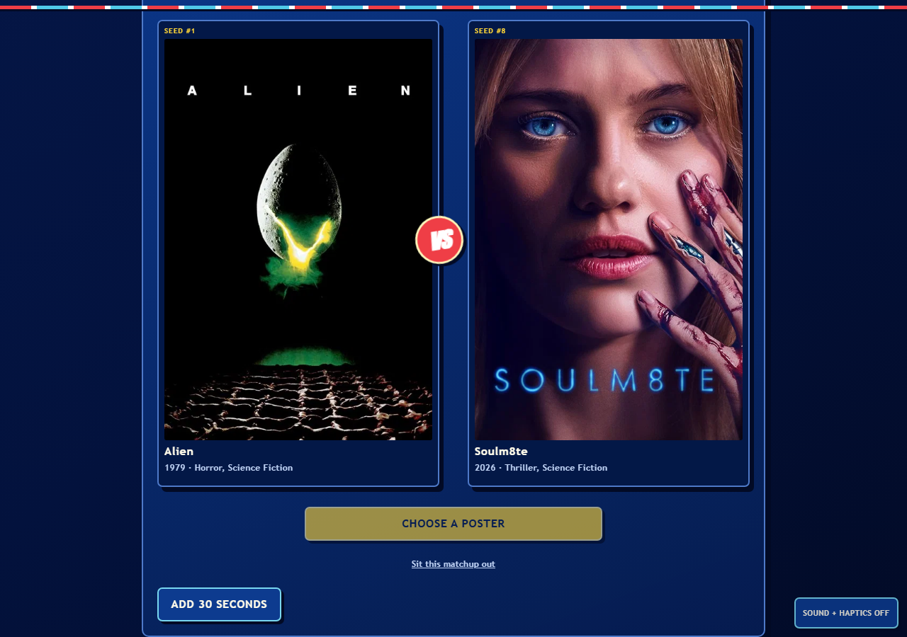
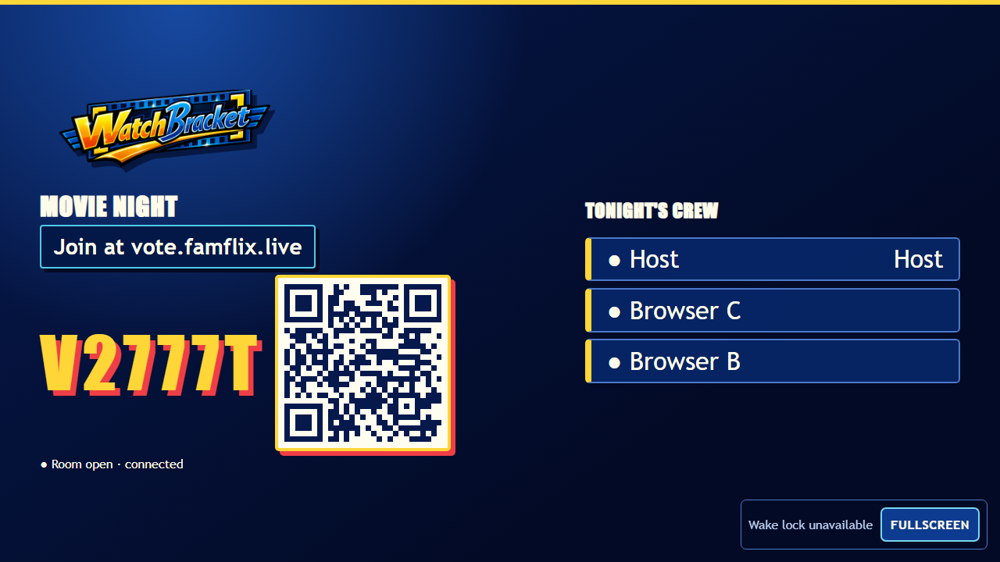
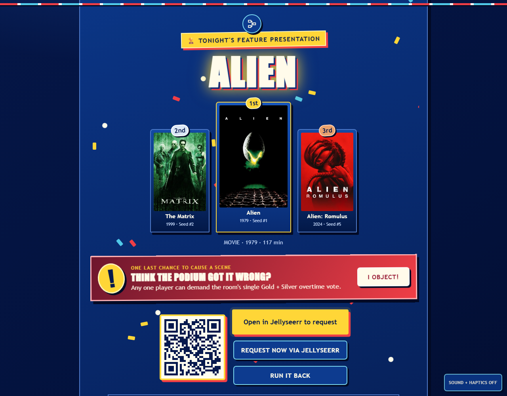
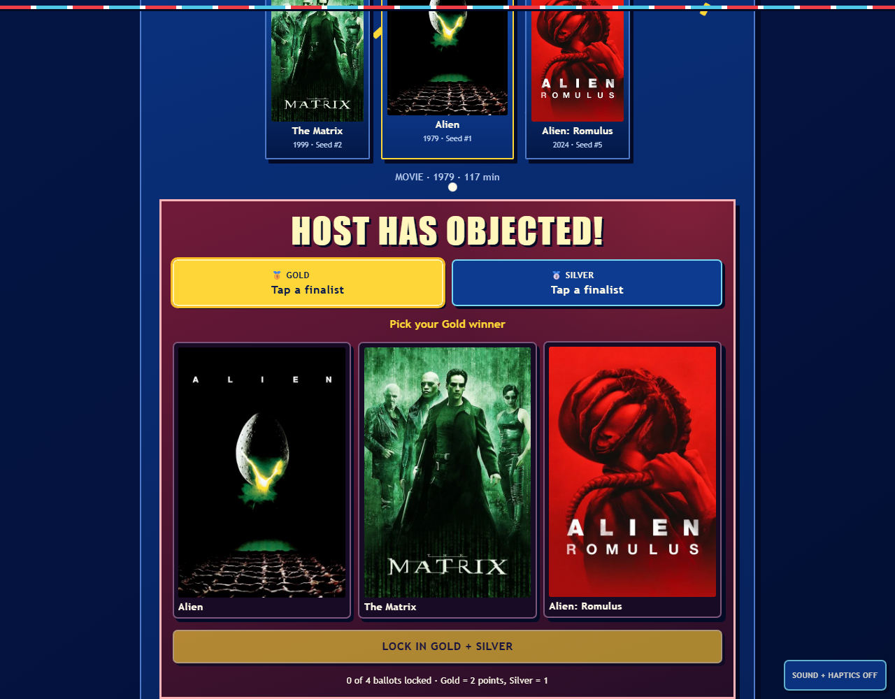
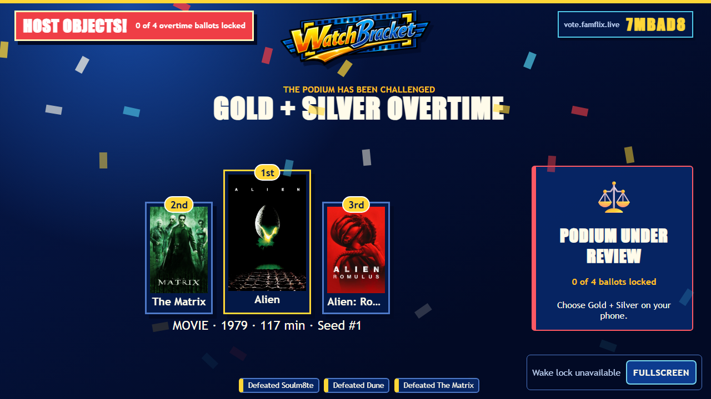

# Watch Bracket

Watch Bracket is a self-hosted, real-time party game for turning “what should we watch?” into a shared decision. V1 implements Milestones 0 through 9: NAS deployment and onboarding, durable realtime rooms, browser and Chromecast displays, private nominations, the complete Double-Take tournament, TMDB/Plex/Tautulli/Seerr-compatible integrations, winner actions, a one-shot “I object!” podium re-vote, household memory, replay, animated presentation, accessibility, and production hardening.

## See it in action

| Start a movie night | Watch the room fill live |
| --- | --- |
|  |  |

| Pin two private picks | Vote poster-first |
| --- | --- |
|  |  |

| Pair the television display | Crown a winner on the podium |
| --- | --- |
|  |  |

| Challenge a close call | Watch the podium go into overtime |
| --- | --- |
|  |  |

## Docker NAS quick start

Install Docker Engine with Docker Compose, then:

```sh
git clone https://github.com/HadenHiles/WatchBracket.git
cd WatchBracket
cp .env.example .env
cp .env.integration.example .env.integration.production
docker network create watchbracket_edge
```

Edit the two private environment files and replace every `replace-me` value. Set `PUBLIC_APP_URL`, `PUBLIC_ALIAS_URL`, the administrator email, and any media-server credentials for your installation. Both files are ignored by Git.

For winner buttons that work outside your home network, set the internal and public addresses separately:

```env
PLEX_BASE_URL=http://plex:32400
SEERR_BASE_URL=http://jellyseerr:5055
SEERR_PUBLIC_URL=https://jellyseerr.example.com
```

Plex winner actions use canonical `app.plex.tv` deep links so supported devices can hand them to the Plex app. `SEERR_PUBLIC_URL` is the safe, credential-free Jellyseerr destination shown to players. Tokens and API keys remain private in `.env.integration.production`.

Participant Plex sign-in survives page reloads for the room session. The Plex token is encrypted in PostgreSQL; browsers retain only the normal room cookie and a non-sensitive connected-account label for seamless UI restoration.

Start everything—including PostgreSQL migrations—with:

```sh
docker compose up -d --build
docker compose ps
```

Connect your existing reverse proxy or Cloudflare Tunnel to `watchbracket_edge`, open `PUBLIC_APP_URL`, and use **Server settings** to complete the guided setup. Creating and joining rooms does not require an account.

After the one-time environment and reverse-proxy setup, routine restarts are simply `docker compose up -d`. Source upgrades should use `git pull --ff-only` followed by `docker compose up -d --build`.

TMDB search and wildcard generation run exclusively through the private integration service. Development and test environments retain the deterministic local catalog as an explicit offline fallback; production never silently fills a bracket with fallback titles that bypass room filters. Google Cast launching requires a registered Custom Web Receiver application ID and a registered physical test device; see `docs/cast/MILESTONE-2.md`.

## Development prerequisites

- Node.js 22.9 or newer
- pnpm 10.34 or newer (pnpm 11 requires Node.js 22.13+)
- Docker Engine with Docker Compose v2 for the full stack

Copy `.env.example` to a private environment file only when running services outside Compose. Never commit the resulting file.

## Start for development

The one-command container path includes PostgreSQL migrations:

```sh
pnpm install --frozen-lockfile
pnpm compose:dev
```

Open `http://localhost:3000`. The development bootstrap account is `host@example.com` / `correct-horse-battery-staple`; it is intentionally limited to the loopback-only development Compose file.

For process-level development, start PostgreSQL, export the variables in `.env.example`, then run:

```sh
pnpm db:migrate
pnpm dev
```

## Verification

```sh
pnpm lint
pnpm typecheck
pnpm test
TEST_DATABASE_URL=postgres://... pnpm test:integration
E2E_BASE_URL=http://127.0.0.1:3000 pnpm test:e2e
pnpm build
pnpm compose:prod:config
```

Integration tests require a real, migrated PostgreSQL database and fail clearly rather than replacing it with memory-backed persistence.

## Architecture

- `apps/web`: Next.js App Router mobile controller and browser display
- `apps/game-api`: Fastify, Socket.IO, authoritative room state, and expiration scheduler
- `apps/integration-service`: private Fastify boundary for narrow, typed TMDB, Plex, Tautulli, and Seerr-compatible operations
- `packages/mock-catalog`: deterministic provider-free catalog used by tests and development fallback only
- `packages/tournament-engine`: pure deterministic 8-, 12-, and 16-title Double-Take rules
- `apps/cast-receiver`: Vite-built Custom Web Receiver and deterministic receiver test mode
- `packages/db`: Drizzle schema and migration; PostgreSQL is durable truth
- `packages/realtime-protocol` and `packages/display-protocol`: versioned Zod contracts

Browsers access one public origin through Caddy. Only the game API reaches PostgreSQL. Display sessions are room-scoped, read-only, independently reconnectable, and revocable.

The Cast sender passes only a single-use launch token over the custom namespace. The receiver exchanges it once and then connects directly to the game API using an in-memory display bearer token. Set `CAST_RECEIVER_APP_ID` at web build time after completing Google Cast registration.

See the [NAS quick start](docs/NAS-QUICKSTART.md), [deployment guide](docs/DEPLOYMENT.md), [UX audit](docs/UX-AUDIT.md), [backup/restore runbook](docs/BACKUP-RESTORE.md), [security model](docs/SECURITY.md), [roadmap](docs/ROADMAP.md), and complete [product specification](docs/SPEC.md).

Implementation notes are tracked per phase in [Milestone 6](docs/MILESTONE-6.md), [Milestone 7](docs/MILESTONE-7.md), [Milestone 8](docs/MILESTONE-8.md), and [Milestone 9](docs/MILESTONE-9.md).
